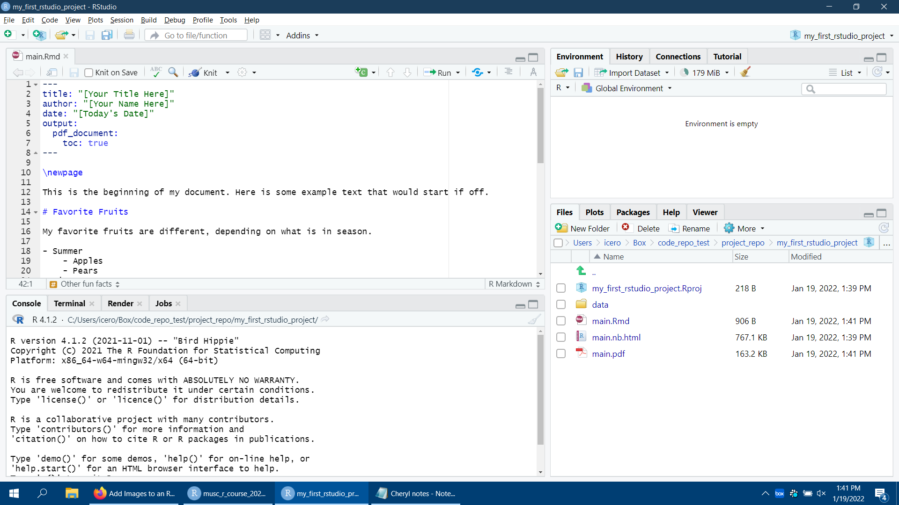

\newpage

This is the beginning of my document. Here is some example text that would start if off.

# Favorite Fruits

My favorite fruits are different, depending on what is in season.

- Summer
    - Apples
    - Pears
- Winter
    - Bananas
    - Oranges

## Other comments on fruit

When I'm kind of excited to eat an apple, I use *italicized text*. However, when I am especially excited, I use **bold text**.

# My favorite digital products

## Favorite Search Engine

My favorite search engine is Google. You can find it at [this hyperlink](www.google.com)

## Other fun facts

R can be used as a calculator, like below

```{r}
1 + 2
```
\newpage

# Final product

A picture of the final product of this exercise should look like this.



