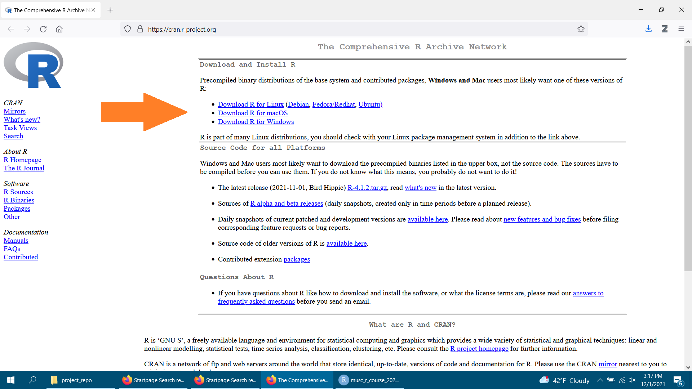
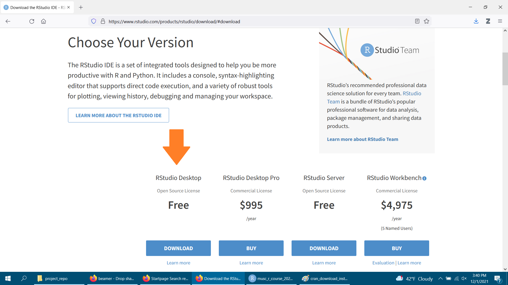
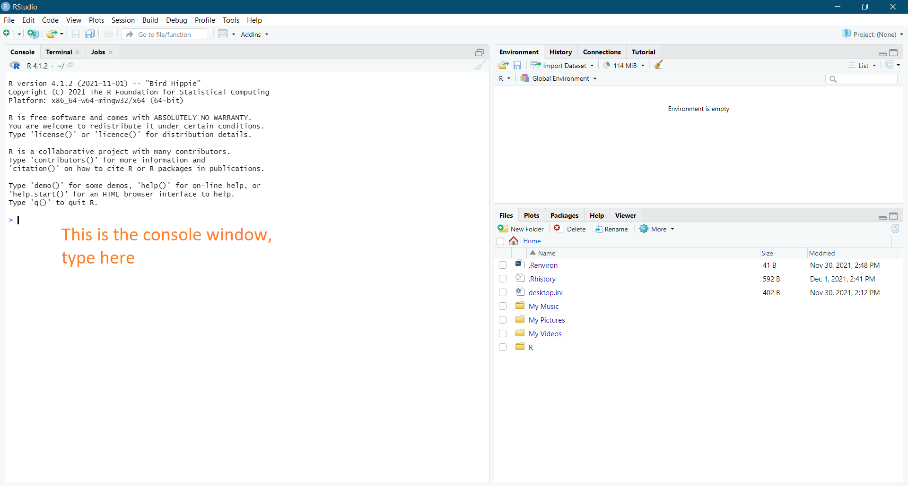

# Getting Started

Under most circumstances, getting started with R is a straightforward process of downloading and installing a few components. In what follows, we'll talk about what those components are, and the order in which you'll want to install them.

**NOTE:** the order of installation matters, so please be careful to follow the instructions in the order given below.

## Overview of the R ecosystem

Most of the time you are using R for data analysis, you'll want to remember that you are working with a whole ecosystem of analysis tools. Understanding the different roles these tools serve in your project will help you keep track of the best way to use them - and hopefully make your R experience more intuitive.

The **R ecosystem** you'll be using for data analysis generally consists of three parts:

- The **R language**, which is a coding language (like Java or Python) that was optimized for talking to computers about statistical problems. When you download and install "R" (step 1, below), you are teaching your computer how to "speak" that R language.

- The **RStudio Integrated Development Environment (IDE)** is a program that you will use to make it easier to talk to your computer in the R language. Think of R as a language and RStudio as a chat app that has a bunch of features (e.g., your contacts list, spell check) that make the chat experience faster and easier for you.

- **R Packages** are collections of code that other people have written to make R perform particular tasks, usually around a them. For example, there are packages for making R perform new types of analyses, but also for streamlining data cleaning. You can download these packages with R's `install.packages()` command, so that your computer can use them too. Think of packages like special tricks you are teaching your computer. Once it learns the trick (i.e., installs the package) it can do that new trick with R over and over again, making youre live a lot easier.

## Installation

### Step 1 - Download and install the R language

The first step to a functioning R ecosystem on your computer is to install the R language on your computer. It's freely available at the Comprehensive R Archive Network (CRAN), which is an acronym you'll see a lot as we go forward. CRAN is just a group of programmers in charge of maintaining and updating the R language.

To install R, go to [`https://cran.r-project.org/`](https://cran.r-project.org/). Then at the very top of the page, choose the installer that is right for your operating system (i.e., Windows, macOS, Linux).

> **HINT**: Depending on your operating system, the downloads page can be kind of intimidating. What you are looking for is the most updated version of R, which as of today (2021-12-01) is R 4.1.2. If you find that you want something to take you through the process at a more step-by-step pace, this tutorial ([`https://www.datacamp.com/community/tutorials/installing-R-windows-mac-ubuntu`](https://www.datacamp.com/community/tutorials/installing-R-windows-mac-ubuntu)) should have an answer for each operating system.

```{r, echo=FALSE, fig.align='center', fig.cap="https://cran.r-project.org/", out.width = '80%'}

```


### Step 2 - Download and install the RStudio IDE

Several years ago, writing code in R was especially difficult because there was so much to keep track of and it was all hidden behind the code. The RStudio IDE fixed that for us by allowing us to continue coding in R, but this time with a collection of useful windows that keep track of what's happening in our code (e.g., what datasets do we have loaded? what plots have we generated?).

**After you installed R**, installing the RStudio IDE should be fairly straightforward. Just go to their Downloads page ([`https://www.rstudio.com/products/rstudio/download/`](https://www.rstudio.com/products/rstudio/download/)) and choose the **Desktop Version**

```{r, echo=FALSE, fig.align='center', fig.cap="https://www.rstudio.com/products/rstudio/download/", out.width = '80%'}

```

**NOTE:** make sure you finish step 1 first! This will allow you to save several steps linking R and RStudio. This is because if R is installed first, RStudio will do the linking for you automatically.

### Step 3 - Install the `tidyverse` package (optional)

Now that both R and RStudio are installed, let's open RStudio and install some packages. 

1. Once you have Rstudio open, you should see several windows. Find the Console window.
2. Inside that window, type `install.packages('tidyverse')` and press ENTER. 

    - R is case-sensitive, so make sure to type (or copy/paste) the command exactly.
    - This should start an installation process that takes a few minutes (no more than 10) and will install a package you will use basically every time you program in R - so it's very useful to have.
    - If you get an error message while installing, don't worry! That's pretty common and you've probably still done everything right. Just remind me in class and we will make sure to troubleshoot it for you.

```{r, echo=FALSE, fig.align='center', fig.cap="The RStudio IDE", out.width = '80%'}

```
